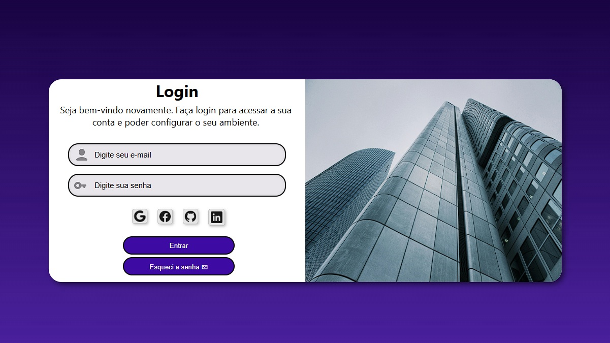

Projeto tela de login

# 🔐 Projeto Login Moderno

Uma interface moderna de login desenvolvida com foco em design responsivo, experiência do usuário e organização visual.

## 🚀 Sobre o projeto

O **Projeto Login Moderno** foi desenvolvido para praticar conceitos essenciais do front-end moderno, criando uma interface elegante, responsiva e inspirada em aplicações reais.

O projeto conta com:

* Tela de login moderna
* Layout responsivo
* Organização visual limpa
* Estrutura semântica
* Experiência otimizada para diferentes dispositivos

## 🛠️ Tecnologias utilizadas

* HTML5
* CSS3
* JavaScript
* Git & GitHub

## 📱 Responsividade

O projeto foi desenvolvido para funcionar corretamente em:

* 💻 Desktop
* 📱 Smartphones
* 📲 Tablets

## ✨ Funcionalidades

* Interface moderna de autenticação
* Campos estilizados
* Responsividade completa
* Estrutura organizada
* Layout intuitivo

## 🎯 Objetivos do projeto

* Evoluir habilidades em front-end
* Melhorar criação de interfaces
* Praticar responsividade
* Desenvolver layouts modernos
* Simular aplicações reais

## 🌐 Deploy

Acesse o projeto online:

👉 https://renannavarro016.github.io/projeto-login/

## 📸 Preview



## 📂 Como executar o projeto

```bash id="9g08gq"
# Clone o repositório
git clone https://github.com/seuusuario/projeto-login.git

# Abra o index.html
```

## 👨‍💻 Desenvolvedor

Desenvolvido por Renan Navarro.

## 📌 Status

✅ Projeto finalizado
